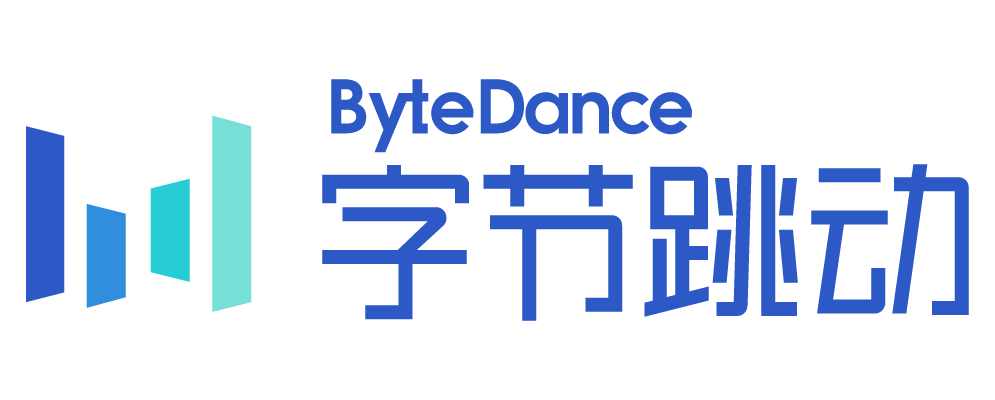

<h2 id="experience" style="margin: 2px 0px 15px;">Experience</h2>

  <ol class="bibliography">
    

      

        
      

      

        
 AI Engineer (Intern) 

        

          <a href="https://www.huawei.com">Huawei</a>
        

        
2025.7 - 2025.8

      

    

     
    

      

        
      

      

        
 Remote Research Associate 

        

          <a href="https://www.tencent.com">Tencent</a>
        

        
2025.2 - 2025.5

      

    

     
    

      

        
      

      

        
 Data Anotator (Intern) 

        

          <a href="https://www.bytedance.com">ByteDance</a>
        

        
2024.7 - 2024.9

      

    

  </ol>

